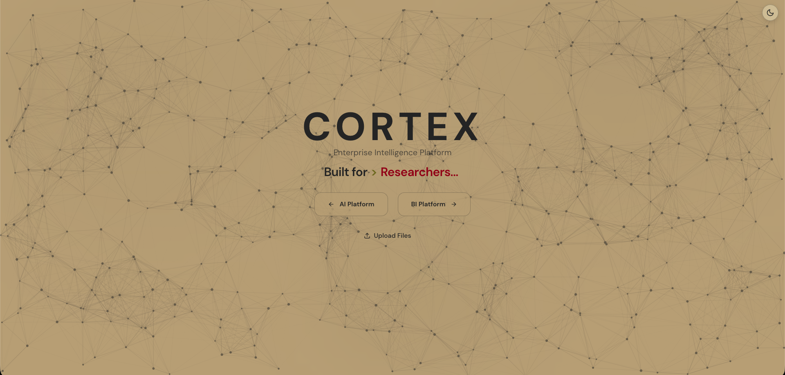

# Cortex

```
   ██████╗ ██████╗ ██████╗ ████████╗███████╗██╗  ██╗
  ██╔════╝██╔═══██╗██╔══██╗╚══██╔══╝██╔════╝╚██╗██╔╝
  ██║     ██║   ██║██████╔╝   ██║   █████╗   ╚███╔╝
  ██║     ██║   ██║██╔══██╗   ██║   ██╔══╝   ██╔██╗
  ╚██████╗╚██████╔╝██║  ██║   ██║   ███████╗██╔╝ ██╗
   ╚═════╝ ╚═════╝ ╚═╝  ╚═╝   ╚═╝   ╚══════╝╚═╝  ╚═╝
        Enterprise Intelligence Platform
```

**Unified BI dashboards, self-service analytics, and AI-powered smart services.**

Cortex combines traditional Business Intelligence capabilities with cutting-edge AI services to deliver a comprehensive data and intelligence platform.



---

## Platform Overview

```
╔═══════════════════════════════════════════════════════════════════════════════╗
║                              CORTEX PLATFORM                                   ║
╠═══════════════════════════════════╦═══════════════════════════════════════════╣
║           BI PLATFORM             ║             AI PLATFORM                   ║
║        ┌─────────────┐            ║          ┌─────────────┐                  ║
║        │  Superset   │            ║          │ Smart Router│                  ║
║        │  :8088      │            ║          │   Agent     │                  ║
║        └──────┬──────┘            ║          └──────┬──────┘                  ║
║               │                   ║                 │                         ║
║  ┌────────────┼────────────┐      ║    ┌────────────┼────────────┐            ║
║  │            ▼            │      ║    │            ▼            │            ║
║  │  ┌─────────────────┐    │      ║    │  ┌─────────────────┐    │            ║
║  │  │   Dashboards    │    │      ║    │  │   RAG Chat      │    │            ║
║  │  │ • KPIs & Charts │    │      ║    │  │ • Document Q&A  │    │            ║
║  │  │ • Real-time     │    │      ║    │  │ • Multi-Persona │    │            ║
║  │  └─────────────────┘    │      ║    │  └─────────────────┘    │            ║
║  │                         │      ║    │                         │            ║
║  │  ┌─────────────────┐    │      ║    │  ┌─────────────────┐    │            ║
║  │  │   Dremio        │    │      ║    │  │   Summarize     │    │            ║
║  │  │   :9047         │    │      ║    │  │ • Key Points    │    │            ║
║  │  │ • Self-Service  │    │      ║    │  │ • Entities      │    │            ║
║  │  │ • SQL Analytics │    │      ║    │  └─────────────────┘    │            ║
║  │  └─────────────────┘    │      ║    │                         │            ║
║  │                         │      ║    │  ┌─────────────────┐    │            ║
║  │  ┌─────────────────┐    │      ║    │  │  Data Quality   │    │            ║
║  │  │ Report Engine   │    │      ║    │  │ • Profiling     │    │            ║
║  │  │ • PDF/DOCX/HTML │    │      ║    │  │ • Anomalies     │    │            ║
║  │  │ • Scheduling    │    │      ║    │  └─────────────────┘    │            ║
║  │  └─────────────────┘    │      ║    │                         │            ║
║  └─────────────────────────┘      ║    └─────────────────────────┘            ║
╚═══════════════════════════════════╩═══════════════════════════════════════════╝
```

---

## Features

### BI Platform Services

| Service | Description |
|---------|-------------|
| **Dashboards** | Interactive KPI dashboards with real-time data visualization |
| **Self-Service Analytics** | Ad-hoc querying and data exploration for business users |
| **Report Builder** | Drag-and-drop report creation with scheduling |
| **Data Exploration** | Browse and analyze data without technical expertise |

### AI Platform Services

| Service | Description |
|---------|-------------|
| **Smart Router** | Automatically classify documents into 100 categories using LLM ensemble |
| **RAG Chat** | Query your documents with context-aware AI responses |
| **Summarization** | Extract key points, entities, and action items from documents |
| **Comparison** | Semantic similarity analysis and document diff |
| **Data Quality** | Automated profiling, anomaly detection, and quality scoring |

### Core Infrastructure

| Component | Description |
|-----------|-------------|
| **Data Lake** | Bronze/Silver/Gold medallion architecture with MinIO |
| **Vector Store** | ChromaDB for semantic search and RAG |
| **Report Engine** | Template-based generation in HTML, PDF, DOCX |

---

## Quick Start

### Prerequisites

- Docker & Docker Compose
- [Ollama](https://ollama.ai/) with models pulled:
  ```bash
  ollama pull qwen2.5:14b
  ollama pull qwen3:8b
  ollama pull gemma2:9b
  ```

### Start Services

```bash
# Clone the repository
git clone https://github.com/AlharbiAbdullah/Cortex.git
cd Cortex

# Start all services
docker compose up -d

# Check status
docker compose ps
```

### Access Points

| Service | URL | Description |
|---------|-----|-------------|
| **Frontend** | http://localhost:3000 | React UI |
| **Backend API** | http://localhost:8000 | FastAPI |
| **API Docs** | http://localhost:8000/docs | Swagger UI |
| **Superset** | http://localhost:8088 | BI Dashboards |
| **Dremio** | http://localhost:9047 | Self-Service Analytics |
| **MinIO Console** | http://localhost:9001 | Object Storage |

---

## Architecture

### System Architecture

```
┌─────────────────────────────────────────────────────────────────────────────────┐
│                              PRESENTATION LAYER                                  │
│  ┌──────────────────┐  ┌──────────────────┐  ┌──────────────────────────────┐   │
│  │   React Frontend │  │    Superset      │  │         Dremio               │   │
│  │      :3000       │  │      :8088       │  │         :9047                │   │
│  │  ┌────────────┐  │  │  ┌────────────┐  │  │  ┌────────────────────────┐  │   │
│  │  │BI Hub     │  │  │  │ Dashboards │  │  │  │  SQL Workbench         │  │   │
│  │  │AI Hub     │  │  │  │ SQL Lab    │  │  │  │  Data Catalog          │  │   │
│  │  │Chat       │  │  │  │ Alerts     │  │  │  │  Virtual Datasets      │  │   │
│  │  └────────────┘  │  │  └────────────┘  │  │  └────────────────────────┘  │   │
│  └────────┬─────────┘  └────────┬─────────┘  └──────────────┬───────────────┘   │
└───────────┼─────────────────────┼───────────────────────────┼───────────────────┘
            │                     │                           │
            ▼                     ▼                           ▼
┌─────────────────────────────────────────────────────────────────────────────────┐
│                              SERVICE LAYER                                       │
│  ┌──────────────────────────────────────────────────────────────────────────┐   │
│  │                      FastAPI Backend :8000                                │   │
│  │  ┌────────────┐ ┌────────────┐ ┌────────────┐ ┌────────────────────────┐ │   │
│  │  │  /upload   │ │   /chat    │ │ /summarize │ │      /quality          │ │   │
│  │  │  /docs     │ │   /qa      │ │ /compare   │ │      /reports          │ │   │
│  │  └────────────┘ └────────────┘ └────────────┘ └────────────────────────┘ │   │
│  │  ┌───────────────────────────────────────────────────────────────────┐   │   │
│  │  │                     LangGraph Smart Router                         │   │   │
│  │  │   Document → Embedding → Classification → Routing → Storage        │   │   │
│  │  └───────────────────────────────────────────────────────────────────┘   │   │
│  └──────────────────────────────────────────────────────────────────────────┘   │
│                                      │                                           │
│  ┌─────────────┐              ┌──────┴──────┐              ┌─────────────────┐  │
│  │   Ollama    │◄────────────►│  LangChain  │◄────────────►│    ChromaDB     │  │
│  │  LLM Host   │              │ Orchestrator│              │  Vector Store   │  │
│  └─────────────┘              └─────────────┘              └─────────────────┘  │
└─────────────────────────────────────────────────────────────────────────────────┘
                                       │
                                       ▼
┌─────────────────────────────────────────────────────────────────────────────────┐
│                               DATA LAYER                                         │
│  ┌─────────────────────────────────────────────────────────────────────────┐    │
│  │                    MinIO Data Lake (Medallion Architecture)              │    │
│  │  ┌─────────────┐      ┌─────────────┐      ┌─────────────────────────┐  │    │
│  │  │   BRONZE    │ ───► │   SILVER    │ ───► │         GOLD            │  │    │
│  │  │  Raw Files  │      │  Processed  │      │   Analysis-Ready        │  │    │
│  │  │  :9000      │      │  + Metadata │      │   + Enrichments         │  │    │
│  │  └─────────────┘      └─────────────┘      └─────────────────────────┘  │    │
│  └─────────────────────────────────────────────────────────────────────────┘    │
│                                                                                  │
│  ┌──────────────┐  ┌──────────────┐  ┌──────────────┐  ┌──────────────────────┐ │
│  │  PostgreSQL  │  │    Redis     │  │   ChromaDB   │  │       Neo4j          │ │
│  │    :5432     │  │    :6379     │  │   (embedded) │  │    :7474/:7687       │ │
│  │  Metadata    │  │  Cache/Jobs  │  │   Vectors    │  │  Knowledge Graph     │ │
│  └──────────────┘  └──────────────┘  └──────────────┘  └──────────────────────┘ │
└─────────────────────────────────────────────────────────────────────────────────┘
```

### Data Flow

```
                                    DOCUMENT INGESTION FLOW
    ┌──────────┐     ┌──────────┐     ┌──────────┐     ┌──────────┐     ┌──────────┐
    │  Upload  │────►│  Bronze  │────►│  Smart   │────►│  Silver  │────►│  Vector  │
    │  /upload │     │  Storage │     │  Router  │     │  Storage │     │  Index   │
    └──────────┘     └──────────┘     └──────────┘     └──────────┘     └──────────┘
         │                                  │
         │                                  ▼
         │                         ┌──────────────┐
         │                         │   Classify   │
         │                         │   Extract    │
         │                         │   Enrich     │
         │                         └──────────────┘
         ▼
    ┌──────────────────────────────────────────────────────────────────────────────┐
    │                              QUERY FLOW                                       │
    │                                                                               │
    │   User ──► Chat API ──► RAG Service ──► Vector Search ──► LLM ──► Response   │
    │              │              │                │               │                │
    │              ▼              ▼                ▼               ▼                │
    │         [Context]    [Embeddings]      [ChromaDB]      [Ollama]              │
    └──────────────────────────────────────────────────────────────────────────────┘


                                    BI ANALYTICS FLOW
    ┌──────────┐     ┌──────────┐     ┌──────────┐     ┌──────────┐
    │  Dremio  │────►│  MinIO   │     │ Superset │────►│PostgreSQL│
    │  Query   │     │ S3 Data  │     │  Query   │     │ Metadata │
    └──────────┘     └──────────┘     └──────────┘     └──────────┘
         │                                  │
         └──────────────►  Dashboard  ◄─────┘
```

### Service Ports

```
    ┌─────────────────────────────────────────────────────────────────┐
    │                        PORT ALLOCATION                          │
    ├─────────────────────────────────────────────────────────────────┤
    │                                                                 │
    │    :3000  ──────────────────────►  React Frontend               │
    │    :8000  ──────────────────────►  FastAPI Backend              │
    │    :8088  ──────────────────────►  Superset (BI Dashboards)     │
    │    :9047  ──────────────────────►  Dremio (Self-Service)        │
    │    :9000  ──────────────────────►  MinIO API                    │
    │    :9001  ──────────────────────►  MinIO Console                │
    │    :5432  ──────────────────────►  PostgreSQL                   │
    │    :6379  ──────────────────────►  Redis                        │
    │    :7474  ──────────────────────►  Neo4j Browser (optional)     │
    │    :7687  ──────────────────────►  Neo4j Bolt (optional)        │
    │                                                                 │
    └─────────────────────────────────────────────────────────────────┘
```

---

## Tech Stack

### Backend
| Technology | Purpose |
|------------|---------|
| FastAPI | Web framework |
| LangChain | LLM orchestration |
| LangGraph | Agent workflows |
| ChromaDB | Vector store |
| PostgreSQL | Metadata storage |
| MinIO | Object storage (data lake) |
| Redis | Caching & job queue |

### Frontend
| Technology | Purpose |
|------------|---------|
| React 18 | UI framework |
| Vite | Build tool |
| Tailwind CSS | Styling |
| React Router | Navigation |

---

## API Endpoints

### Core Services

| Endpoint | Method | Description |
|----------|--------|-------------|
| `/api/upload` | POST | Upload document with smart routing |
| `/api/upload/jobs` | GET | List background processing jobs |
| `/api/chat` | POST | RAG-powered chat |
| `/api/qa` | POST | Simple Q&A |
| `/api/documents` | GET | List Silver documents |
| `/health` | GET | Health check |

### Phase 2 Services

| Endpoint | Method | Description |
|----------|--------|-------------|
| `/api/summarize` | POST | Summarize text/document |
| `/api/compare` | POST | Compare two documents |
| `/api/reports/generate` | POST | Generate report from template |
| `/api/quality/assess` | POST | Assess data quality |

See full API docs at http://localhost:8000/docs

---

## Document Categories

Smart Router classifies documents into **100 categories** across 9 domains:

| Domain | Categories | Examples |
|--------|------------|----------|
| **Business & Operations** | 15 | Operations reports, KPI dashboards, Meeting minutes |
| **Financial** | 15 | Invoices, Budgets, P&L statements |
| **Legal & Regulatory** | 12 | Contracts, NDAs, Compliance reports |
| **Human Resources** | 12 | Resumes, Job descriptions, Performance reviews |
| **Marketing & Sales** | 12 | Campaigns, Market research, Sales reports |
| **Technical & IT** | 12 | API docs, System architecture, User manuals |
| **Research & Academic** | 10 | Research papers, Case studies, Whitepapers |
| **Communications** | 10 | Official letters, Press releases, Memos |
| **Intelligence & Security** | 12 | Threat assessments, Security reports, OSINT |

---

## Development

### Backend Setup

```bash
# Install UV (package manager)
curl -LsSf https://astral.sh/uv/install.sh | sh

# Install dependencies
uv sync

# Run development server
uv run uvicorn cortex.main:app --reload --port 8000

# Run tests
uv run pytest src/cortex/ -v

# Format & lint
uv run ruff format .
uv run ruff check .
```

### Frontend Setup

```bash
cd frontend

# Install dependencies
npm install

# Run development server
npm run dev

# Build for production
npm run build
```

---

## Docker Services

### Default Services

```bash
docker compose up -d
```

| Service | Port | Credentials |
|---------|------|-------------|
| Backend | 8000 | - |
| Frontend | 3000 | - |
| PostgreSQL | 5432 | postgres/postgres |
| MinIO | 9000/9001 | minioadmin/minioadmin123 |
| Redis | 6379 | - |
| Superset | 8088 | admin/admin |
| Dremio | 9047 | First-time setup (see below) |

### With Neo4j (Full Profile)

```bash
docker compose --profile full up -d
```

| Service | Port | Credentials |
|---------|------|-------------|
| Neo4j | 7474/7687 | neo4j/password123 |

---

## BI Tools Configuration

### Apache Superset (Dashboards)

Superset is a modern data exploration and visualization platform.

**Access**: http://localhost:8088

**Default Credentials**:
- Username: `admin`
- Password: `admin`

**Getting Started**:
1. Navigate to http://localhost:8088
2. Log in with `admin` / `admin`
3. Go to **Settings** → **Database Connections** to add data sources
4. Connect to the Cortex PostgreSQL database:
   - Host: `db`
   - Port: `5432`
   - Database: `cortex_db`
   - Username: `postgres`
   - Password: `postgres`
5. Create charts and dashboards from **Charts** → **+ Chart**

**Key Features**:
- SQL Lab for ad-hoc queries
- Drag-and-drop dashboard builder
- 40+ visualization types
- Scheduled reports and alerts

### Dremio (Self-Service Analytics)

Dremio is a data lakehouse platform for self-service analytics.

**Access**: http://localhost:9047

**First-Time Setup**:
1. Navigate to http://localhost:9047
2. Create an admin account (first user becomes admin):
   - Recommended: `admin` / `admin123`
3. Complete the setup wizard

**Connecting to Data Sources**:
1. Click **Add Source** in the left panel
2. Add MinIO (S3-compatible):
   - Source Type: **Amazon S3**
   - Name: `cortex-datalake`
   - AWS Access Key: `minioadmin`
   - AWS Secret Key: `minioadmin123`
   - Endpoint: `http://minio:9000`
   - Enable **Path Style Access**
3. Add PostgreSQL:
   - Source Type: **PostgreSQL**
   - Name: `cortex-db`
   - Host: `db`
   - Port: `5432`
   - Database: `cortex_db`
   - Username: `postgres`
   - Password: `postgres`

**Key Features**:
- Query data lake files (Parquet, JSON, CSV) with SQL
- Virtual datasets and data curation
- High-performance Arrow Flight queries
- Semantic layer for business-friendly data access

---

## Environment Variables

Copy `.env.example` to `.env` and configure:

```bash
# LLM Configuration
OLLAMA_URL=http://localhost:11434
OLLAMA_DEFAULT_MODEL=qwen2.5:14b

# Database
DB_HOST=localhost
DB_PORT=5432
DB_NAME=cortex_db
DB_USER=postgres
DB_PASSWORD=postgres

# MinIO (Data Lake)
MINIO_ENDPOINT=localhost:9000
MINIO_ACCESS_KEY=minioadmin
MINIO_SECRET_KEY=minioadmin123
MINIO_BRONZE_BUCKET=bronze
MINIO_SILVER_BUCKET=silver
MINIO_GOLD_BUCKET=gold

# Redis
REDIS_URL=redis://localhost:6379/0
```

---

## Project Structure

```
Cortex/
├── src/cortex/
│   ├── main.py                 # FastAPI application
│   ├── agents/
│   │   └── smart_router/       # LangGraph classification agent
│   ├── database/               # PostgreSQL models & connection
│   ├── services/
│   │   ├── minio/              # Bronze/Silver/Gold layers
│   │   ├── qa_service.py       # RAG Q&A
│   │   ├── document_service.py
│   │   ├── summarization_service.py
│   │   ├── comparison_service.py
│   │   ├── report_service.py
│   │   └── data_quality_service.py
│   ├── routers/                # API endpoints
│   ├── models/                 # Pydantic models
│   └── jobs/                   # Background processing
├── frontend/
│   ├── src/
│   │   ├── components/         # React components
│   │   ├── pages/              # Page components
│   │   └── hooks/              # Custom hooks
│   └── ...config files
├── docker-compose.yml
├── Dockerfile
├── pyproject.toml
├── TESTING.md                  # Testing guide
└── README.md
```

---

## Testing

See [TESTING.md](./TESTING.md) for comprehensive test scenarios including:

- Document upload and routing tests
- RAG chat with different personas
- API endpoint testing with cURL
- Sample test data files

Quick test:

```bash
# Health check
curl http://localhost:8000/health

# Upload a document
curl -X POST http://localhost:8000/api/upload \
  -F "file=@document.pdf"

# Chat
curl -X POST http://localhost:8000/api/chat \
  -H "Content-Type: application/json" \
  -d '{"message": "What documents are available?", "use_rag": true}'
```

---

## License

Private repository.

---

## Contributing

1. Create a feature branch: `git checkout -b feature/your-feature`
2. Make changes and run tests: `uv run pytest`
3. Format code: `uv run ruff format . && uv run ruff check .`
4. Push and create a Pull Request
